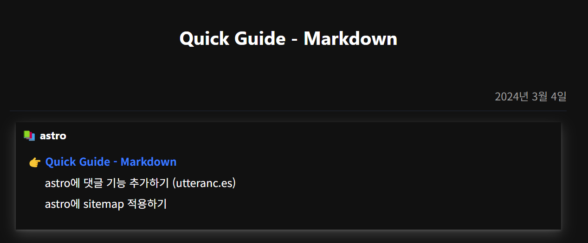

# Dark/Light 테마 모드 지원
> global.css를 통한 스타일 관리
> 
> 

#  pagination 기능 적용
> blog 리스트에 Pagination을 통한 포스트 리스트 관리
> 
 

# TOC 기능 적용
> 

# rss.xml 제공
> 

# sitemap.xml 제공
> 
> 

# search 기능 지원
- title, description 에 대해서만 검색 지원

# series 기능 지원
>Post에서는

>Series 페이지에서

# gist 변환 기능 제공

# mermaid 변환 기능 제공

