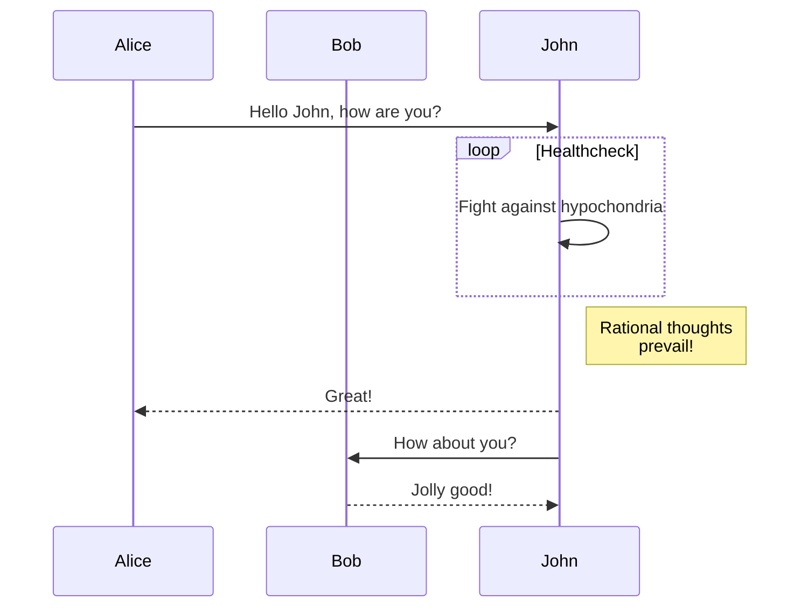

# Heading 태그

# # Heading 1
## ## Heading 2
### ### Heading 3
#### #### Heading 4
##### ##### Heading 5
##### ###### Heading 6

<br/><hr/>

# 이미지 태그
```markdown

```


<br/><hr/>

# 텍스트 스타일
```markdown
- 스타일을 확인해보세요. **볼드** 문자열
- 스타일을 확인해보세요. ___이태릭___ 문자열 
- 스타일을 확인해보세요. ~~취소선~~
```

- 스타일을 확인해보세요. **볼드** 문자열
- 스타일을 확인해보세요. ___이태릭___ 문자열
- 스타일을 확인해보세요. ~~취소선~~
<br/><hr/>

# 각주
```markdown
각주[^1]
[^1]: 이 라인이 있어야 스타일이 자동 적용됨. 페이지 맨 밑에 표시
```
각주[^1]
[^1]: 이 라인이 있어야 스타일이 자동 적용됨. 페이지 맨 밑에 표시


<br/><hr/>

# 인용 구문

```markdown
> 왼쪽에 파란색 바가 보입니다 <br/>
> br 태그를 써서 여러줄을 쓰면 이어져요
```
> 왼쪽에 파란색 바가 보입니다 <br/>
> br 태그를 써서 여러줄을 쓰면 이어져요


<br/><hr/>

# 표

```markdown
| Italics   | Bold     | Code   |
| --------- | -------- | ------ |
| _italics_ | **bold** | `code` |
```

<div style='background-color: gray'>

| Italics   | Bold     | Code   |
| --------- | -------- | ------ |
| _italics_ | **bold** | `code` |

</div>

<br/><hr/>

# 코드

````markdown
```html
<!doctype html>
<html lang="en">
  <head>
    <meta charset="utf-8" />
    <title>Example HTML5 Document</title>
  </head>
  <body>
    <p>Test</p>
  </body>
</html>
```
````

<br/><hr/>

# 리스트

````markdown
```markdown
1. 일
2. 이
3. 삼
```
````

1. 일
2. 이
3. 삼


````markdown
```markdown
- 과일
  - 사과
  - 바나나
- 채소
  - 감자
    - 감자튀김
    - 고로케
  - 고구마
```
````

- 과일
    - 사과
    - 바나나
- 채소
    - 감자
      - 감자튀김
      - 고로케
    - 고구마


<br/>
<br/>
<br/>
<br/>

# Gist 적용하기

````
```gist
declue/0adbcb128831725f57409e051c3810af
```
````

```gist
declue/0adbcb128831725f57409e051c3810af
```


# Mermaid
````

````

````

````


